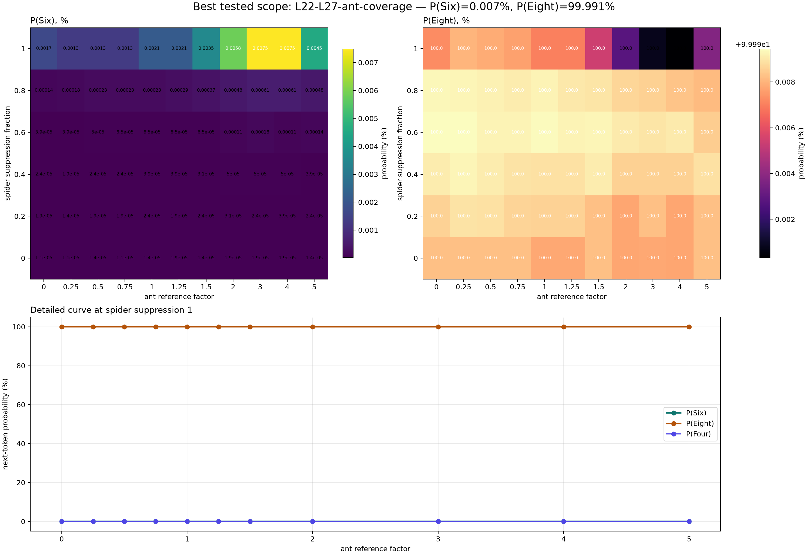
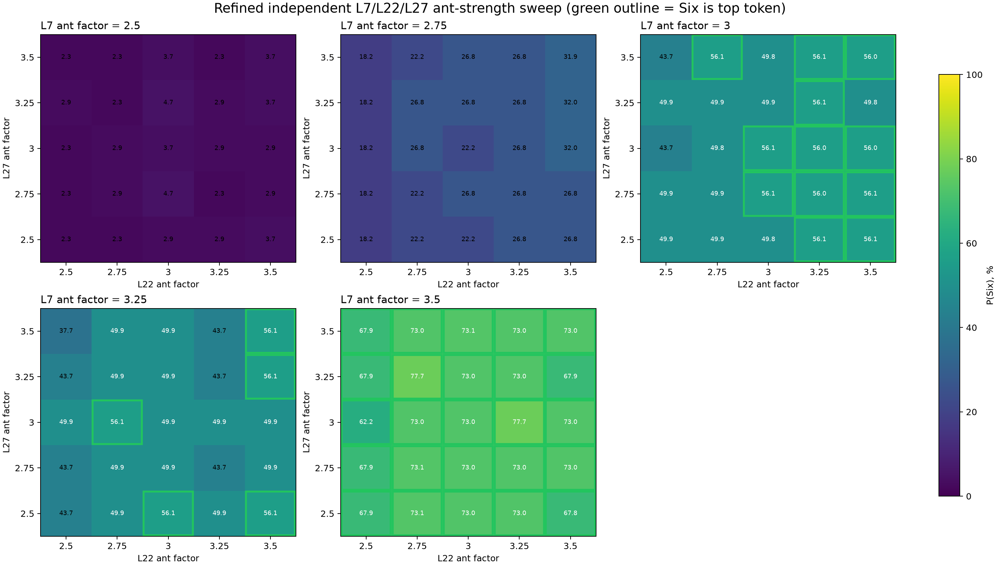
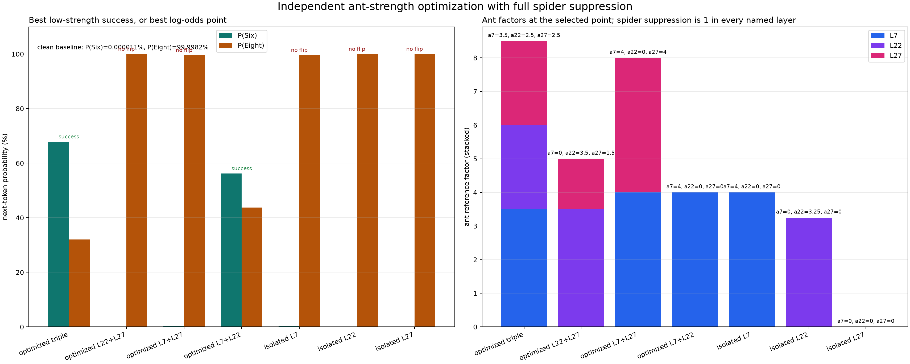
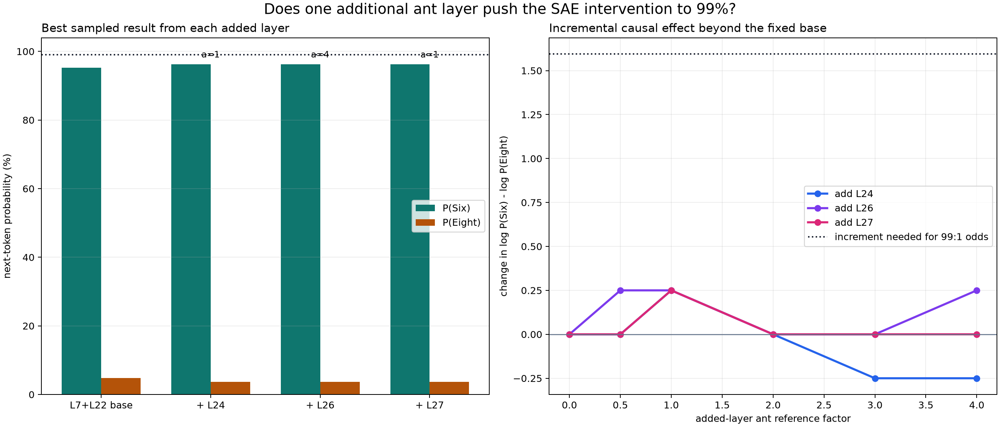

# Results: 2026-08-29

Add result entries below this line.

## Original hand-selected spider features over prompt history

*Gemma-3-4B-IT answered Eight with 99.998% probability. The four hand-selected spider features from the original intervention are shown across all 27 prompt tokens; this is not a layerwise feature search. All four activate at position 16 (spinning) and position 21 (the turn-boundary newline), while two remain active at position 17 (animal). Each panel has its own y-axis, so activation should be compared across positions within a feature rather than across different features.*

Source: `scripts/plot_spider_feature_activations.py`
Figure: `docs/assets/results/2026-08-29/spider_feature_activation_history.png`
Data: [raw feature activations](../assets/results/2026-08-29/spider_feature_activation_history.json)

## Cross-layer spider-feature activation search

![A bounded Neuronpedia semantic search returned 85 explicit spider, arachnid, or web-labelled Gemma Scope 262k transcoder candidates across 26 layers. Of these, 36 activated on the clean prompt across 17 layers: L3, L6-L9, and L22-L33. Position 16 (spinning) was dominant with 31 active feature instances; position 21 (the turn-boundary newline) had 18, and position 17 (animal) had 8. The L16 candidate F53522 (spider phobia) never crossed its threshold. Gray rows had no candidate in the bounded top-100 search and are not evidence of absence; black cells are zero activation. Color shows activation divided by each feature’s Neuronpedia approximate maximum, taking the strongest candidate per layer-token cell.](../assets/results/2026-08-29/spider_layerwise_search.png)

*A bounded Neuronpedia semantic search returned 85 explicit spider, arachnid, or web-labelled Gemma Scope 262k transcoder candidates across 26 layers. Of these, 36 activated on the clean prompt across 17 layers: L3, L6-L9, and L22-L33. Position 16 (spinning) was dominant with 31 active feature instances; position 21 (the turn-boundary newline) had 18, and position 17 (animal) had 8. The L16 candidate F53522 (spider phobia) never crossed its threshold. Gray rows had no candidate in the bounded top-100 search and are not evidence of absence; black cells are zero activation. Color shows activation divided by each feature’s Neuronpedia approximate maximum, taking the strongest candidate per layer-token cell.*

Source: `scripts/scan_spider_features_across_layers.py`
Figure: `docs/assets/results/2026-08-29/spider_layerwise_search.png`
Data: [full measurements](../assets/results/2026-08-29/spider_layerwise_search.json) · [feature summary CSV](../assets/results/2026-08-29/spider_layerwise_features.csv)

## Cross-layer ant-feature activation on the spider prompt

![Using the same clean spider prompt and normalization as the spider scan, a bounded semantic search plus the two forced original steering features produced 82 ant-labelled Gemma Scope 262k transcoder candidates across 26 layers. Only two activated naturally: L5 F19866 (ants and termites) at position 11 (legs), and L29 F256407 (ants) at positions 12 (does), 13 (a), and 16 (spinning). Neither original L22 steering feature, F1703 or F197021, crossed its learned threshold at any token; the earlier ant manipulation therefore injected absent feature activations rather than amplifying an endogenous ant signal. Gray rows had no candidate in the bounded search, while black cells are zero activation.](../assets/results/2026-08-29/ant_layerwise_search.png)

*Using the same clean spider prompt and normalization as the spider scan, a bounded semantic search plus the two forced original steering features produced 82 ant-labelled Gemma Scope 262k transcoder candidates across 26 layers. Only two activated naturally: L5 F19866 (ants and termites) at position 11 (legs), and L29 F256407 (ants) at positions 12 (does), 13 (a), and 16 (spinning). Neither original L22 steering feature, F1703 or F197021, crossed its learned threshold at any token; the earlier ant manipulation therefore injected absent feature activations rather than amplifying an endogenous ant signal. Gray rows had no candidate in the bounded search, while black cells are zero activation.*

Source: `scripts/scan_spider_features_across_layers.py`
Figure: `docs/assets/results/2026-08-29/ant_layerwise_search.png`
Data: [full measurements](../assets/results/2026-08-29/ant_layerwise_search.json) · [feature summary CSV](../assets/results/2026-08-29/ant_layerwise_features.csv)

## Layerwise spider-to-ant causal manipulation sweep

The clean spider prompt reproduced `P(Eight) = 99.99825%`. Applying the `0.4` normalized-activation cutoff at positions 16 and 21 selected 26 spider feature-position instances across 12 layers. The matched 27-token implicit ant prompt answered Six with `99.99714%`, but supplied no saved ant feature above the cutoff at its aligned positions 16 and 21. The explicit fallback answered Six with `99.99999%`; mapping its `ant` token to spider position 16 yielded four eligible ant targets across L7, L22, and L27. No qualifying ant feature activated at the fallback turn boundary, so nine otherwise spider-eligible layers were skipped rather than given invented targets.

*No isolated layer succeeded. The log-odds panel exposes changes that a linear 0–100% probability chart would hide. L7 was the strongest isolated layer, but its best overdrive cell still left `P(Eight) = 99.9328%`.*

The greedy L7+L22 pair came close only at full spider suppression and ant factor `3.0`: `P(Six) = 43.6532%` versus `P(Eight) = 56.0518%`. Adding L27 produced the only successful sampled cell, again at full suppression and factor `3.0`: Six became the top token with `P(Six) = 56.0518%`, `P(Eight) = 43.6532%`, and `P(Four) = 0.2941%`. The remaining top tokens together carried less than `0.001%`, so this looks like a focused Six/Eight replacement rather than broad output disruption, but it required a three-layer overdrive intervention and is not a minimal single-layer steering result.

*The crossover occurs only at the last overdrive cell. No negative spider target was used. The `0.4` value controlled feature selection, while suppression and injection strengths were varied independently.*

Eligible ant targets: L7 F42685 (`ants, ant colonies`), L22 F1703 and F197021 (the two forced original steering IDs), and L27 F248182 (`Ants`). Their normalized reference activations were `0.663`, `0.607`, `0.482`, and `0.484`, respectively.

Source: `scripts/run_layerwise_spider_ant_sweep.py` · [download script snapshot](../assets/results/2026-08-29/run_layerwise_spider_ant_sweep.py)

Figures: `docs/assets/results/2026-08-29/layerwise_sweep_overview.png` · `docs/assets/results/2026-08-29/layerwise_sweep_best_detail.png`

Data: [raw JSON](../assets/results/2026-08-29/layerwise_spider_ant_sweep.json) · [tidy CSV](../assets/results/2026-08-29/layerwise_spider_ant_sweep.csv) · [frozen feature manifest](../assets/results/2026-08-29/layerwise_feature_manifest.json)

Per-layer heatmaps: [L7](../assets/results/2026-08-29/L07_probability_heatmaps.png) · [L22](../assets/results/2026-08-29/L22_probability_heatmaps.png) · [L27](../assets/results/2026-08-29/L27_probability_heatmaps.png)

## Cumulative L22-L27 intervention

This follow-up tested whether manipulating more consecutive late layers would strengthen the replacement. In every scope, all selected spider feature instances were suppressed at prompt positions 16 (`spinning`) and 21 (the newline after `<end_of_turn>`). Ant features were injected only at position 16, aligned from the explicit reference prompt's `ant` token; no calibrated ant target was available at position 21.

The first stage cumulatively suppressed spider features in L22, then L22-L23, through L22-L27, while retaining ant injection only in the previously calibrated L22 and L27 layers. None of the 324 cells succeeded. Every scope reached its maximum sampled `P(Six)` at full spider suppression and ant factor `3.0`:

| Scope | Spider instances | Ant instances | Best P(Six) | Paired P(Eight) |
| --- | ---: | ---: | ---: | ---: |
| L22 | 3 | 2 | 0.001670% | 99.997282% |
| L22-L23 | 5 | 2 | 0.002754% | 99.996197% |
| L22-L24 | 7 | 2 | 0.002144% | 99.996805% |
| L22-L25 | 10 | 2 | 0.003536% | 99.995625% |
| L22-L26 | 13 | 2 | 0.007485% | 99.991453% |
| L22-L27 | 17 | 3 | **0.012339%** | **99.986315%** |

*The strongest full-window result remains far from a crossover. Adding L24 reduced `P(Six)` relative to L22-L23, so these interventions do not simply accumulate as interchangeable votes for Six.*

Source: `scripts/run_spider_ant_depth_window_sweep.py` · [download script snapshot](../assets/results/2026-08-29/run_spider_ant_depth_window_sweep.py)

Figures: [summary](../assets/results/2026-08-29/spider_ant_depth_window_summary.png) · [full-window heatmaps](../assets/results/2026-08-29/spider_ant_depth_window_full_heatmap.png) · [strength curves](../assets/results/2026-08-29/spider_ant_depth_window_curves.png)

Data: [raw JSON](../assets/results/2026-08-29/spider_ant_depth_window_sweep.json) · [tidy CSV](../assets/results/2026-08-29/spider_ant_depth_window_sweep.csv) · [frozen feature manifest](../assets/results/2026-08-29/spider_ant_depth_window_manifest.json)

## L22-L27 ant-coverage fallback

Because calibrated ant injection only at L22 and L27 failed, a broader live Neuronpedia search evaluated 72 ant-labelled candidates across L22-L27 on the explicit ant reference prompt. It preserved L22 F1703, L22 F197021, and L27 F248182, then selected the strongest naturally active explicit-`ant` feature in each missing layer: L23 F82603, L24 F209073, L25 F236757, and L26 F73903. Their normalized reference activations were `0.156`, `0.788`, `0.185`, and `0.812`; L23 and L25 were therefore explicitly labelled below-cutoff coverage targets rather than silently treated as passing the `0.4` rule.

With spider suppression in every layer L22-L27 and ant injection in every layer L22-L27, none of 66 cells succeeded. The best cell was again full suppression and ant factor `3.0`: `P(Six) = 0.007484%`, `P(Eight) = 99.990797%`, and `P(Four) = 0.001670%`. Extending ant strength to factors `4.0` and `5.0` did not help; factor `5.0` reduced `P(Six)` to about `0.0045%`.

*Broader late-layer coverage was worse than injecting only at L22 and L27. Together with the earlier L7+L22+L27 success, this points to a specific cross-depth interaction involving L7, not a rule that steering becomes stronger whenever more late layers are edited.*

Source: `scripts/run_spider_ant_full_window_coverage_sweep.py` · [download script snapshot](../assets/results/2026-08-29/run_spider_ant_full_window_coverage_sweep.py)

Figures: [detailed sweep](../assets/results/2026-08-29/spider_ant_full_window_coverage_detail.png) · [heatmaps](../assets/results/2026-08-29/spider_ant_full_window_coverage_heatmap.png) · [best-strength curve](../assets/results/2026-08-29/spider_ant_full_window_coverage_curve.png)

Data: [raw JSON](../assets/results/2026-08-29/spider_ant_full_window_coverage_sweep.json) · [tidy CSV](../assets/results/2026-08-29/spider_ant_full_window_coverage_sweep.csv) · [frozen feature manifest](../assets/results/2026-08-29/spider_ant_full_window_coverage_manifest.json)

## Independent L7/L22/L27 strength optimization

The shared-factor result did not imply that all three layers wanted the same ant amplitude. This experiment therefore fixed spider suppression at `1.0` (selected spider activations were targeted to zero) while assigning separate ant-reference factors to L7, L22, and L27. It ran a 64-cell coarse cube over factors `{0, 1, 2, 3}`, a 125-cell refinement around the first coarse success, anchored leave-one-layer-out tests, independently optimized each pair, and finally screened every isolated layer from factor `0` through `5` in steps of `0.25`. Duplicate configurations were cached, leaving 391 unique forward passes and 57 successful cells.

*The coarse cube explains why adding only late layers failed. L22 and L27 factors have little effect until the L7 ant direction is already strong.*

The refined triple's lowest-factor successful point was `a7=3.5`, `a22=2.5`, `a27=2.5`, with `P(Six)=67.8631%`, `P(Eight)=32.0562%`, and `P(Four)=0.0795%`. The highest-confidence refined triple used `a7=3.5`, `a22=3.25`, `a27=3.0`, reaching `P(Six)=77.6862%` and `P(Eight)=22.2575%`. Neighboring cells sometimes returned to an approximately 50/50 Six/Eight tie, confirming a nonlinear, quantized-looking response rather than a smooth additive effect.

*Green outlines mark cells in which Six is the top next token. Probabilities are percentages; all named layers still receive full spider suppression.*

The pair search found a simpler causal intervention:

| Scope | Ant factors | P(Six) | P(Eight) | P(Four) | Outcome |
| --- | --- | ---: | ---: | ---: | --- |
| L7+L22, lowest-factor success | `a7=4`, `a22=0` | **56.1927%** | 43.7630% | 0.0399% | Six |
| L7+L22, maximum P(Six) | `a7=4`, `a22=4` | **95.2221%** | 4.7408% | 0.0319% | Six |
| L7+L27, maximum P(Six) | `a7=4`, `a27=3.75` | 0.4068% | 99.5491% | 0.0429% | Eight |
| L22+L27, maximum P(Six) | `a22=3.5`, `a27=1.75` | 0.0045% | 99.9937% | 0.0017% | Eight |

In the lowest-factor success, `a22=0` means **no ant feature was injected at L22**, but L22 was not inactive: its spider features were fully suppressed. Specifically, the intervention suppresses L7 F14209 and F137239 at position 16 (`spinning`); suppresses L22 F23422 at positions 16 and 21 and F60476 at position 16; and injects only the L7 ant feature F42685 at position 16 with factor `4`. L27 is untouched.

*No isolated layer flipped through ant factor `5`. Isolated L7 peaked semantically at only `P(Six)=0.3172%` at factor `4`; by factor `5`, `Zero` became the top token, indicating output disruption rather than a stronger spider-to-ant replacement. Thus the tested two-layer result reflects an interaction between L7 ant injection and L22 spider suppression, not L7 steering alone.*

The clean baseline before and after all 391 interventions matched exactly at `P(Eight)=99.99825%`, confirming that every hook was removed.

Source: `scripts/run_spider_ant_layer_specific_optimization.py` · [download script snapshot](../assets/results/2026-08-29/run_spider_ant_layer_specific_optimization.py)

Figures: [coarse cube](../assets/results/2026-08-29/spider_ant_layer_specific_coarse_cube.png) · [refined cube](../assets/results/2026-08-29/spider_ant_layer_specific_refined_cube.png) · [scope summary](../assets/results/2026-08-29/spider_ant_layer_specific_summary.png)

Data: [raw JSON](../assets/results/2026-08-29/spider_ant_layer_specific_optimization.json) · [tidy CSV](../assets/results/2026-08-29/spider_ant_layer_specific_optimization.csv) · [frozen feature manifest](../assets/results/2026-08-29/spider_ant_layer_specific_manifest.json) · [complete run log](../assets/results/2026-08-29/spider_ant_layer_specific_run.log)

## Add one ant layer to the 95% L7+L22 intervention

This experiment held the exact high-confidence two-layer result fixed: the selected L7 and L22 spider features were fully suppressed, L7 F42685 was injected at position 16 with ant-reference factor `4`, and L22 F1703 and F197021 were injected at position 16 with factor `4`. It then added an ant feature at **one new layer at a time**, also at position 16, without suppressing any spider feature in that added layer.

The explicit ant reference again answered Six with `99.99999%`. Fresh activation measurements exactly reproduced all saved calibration values. The eligible add-on features were L24 F209073 (`ant`, normalized reference activation `0.788`), L26 F73903 (`ant`, `0.812`), and L27 F248182 (`Ants`, `0.484`). All passed the frozen `0.4` cutoff.

| Configuration | Best add-on factor | P(Six) | P(Eight) | P(Four) | Change in Six-vs-Eight log odds |
| --- | ---: | ---: | ---: | ---: | ---: |
| Frozen L7+L22 base | — | 95.2221% | 4.7408% | 0.0319% | — |
| Add L24 F209073 | **1** | **96.2323%** | 3.7313% | 0.0323% | +0.25 |
| Add L26 F73903 | 4 | **96.2323%** | 3.7313% | 0.0323% | +0.25 |
| Add L27 F248182 | 1 | 96.2234% | 3.7310% | 0.0414% | +0.25 |

No cell reached the `99%` target. Moving from the base log odds of `3.00` to 99:1 Six-vs-Eight odds requires an increment of about `1.595`; the best added layer supplied only `0.25`. L24 was the most efficient add-on: factor `1` added decoder-delta norm `1013.9`, whereas L26 required factor `4` and delta norm `5001.9` to reach the same sampled output probabilities.

*The response is non-monotonic. L24 factor `1` helps, but factors `3` and `4` reduce `P(Six)` below the frozen base. L26 and L27 likewise alternate between small changes and no measurable log-odds change rather than accumulating smoothly with strength.*

The added-layer measurements also expose a downstream-state effect. Each candidate feature had zero activation on the clean spider prompt. Under the frozen L7+L22 intervention, before any added-layer delta, L24 F209073 was already active at `620.916` and L26 F73903 at `456.423`; L27 F248182 remained at zero. Thus the successful upstream intervention already induces ant-labelled activity at L24 and L26. The extra L24 factor-1 edit raised its activation from `620.916` to `1634.831`.

*Adding one calibrated late-layer ant feature produces a real but small improvement. It does not justify further arbitrary strength escalation, and it leaves the 95.22% two-layer configuration as the useful SAE comparison point for an independently localized Jacobian-Lens intervention.*

All three factor-`0` controls exactly matched the frozen base. The clean pre-sweep and post-sweep baselines also matched exactly at `P(Eight)=99.99825%`, confirming hook cleanup.

Source: `scripts/run_spider_ant_added_layer_sweep.py` · [download script snapshot](../assets/results/2026-08-29/run_spider_ant_added_layer_sweep.py)

Figures: [probability curves](../assets/results/2026-08-29/spider_ant_added_layer_curves.png) · [layer summary](../assets/results/2026-08-29/spider_ant_added_layer_summary.png)

Data: [raw JSON](../assets/results/2026-08-29/spider_ant_added_layer_sweep.json) · [tidy CSV](../assets/results/2026-08-29/spider_ant_added_layer_sweep.csv) · [frozen feature manifest](../assets/results/2026-08-29/spider_ant_added_layer_manifest.json) · [complete run log](../assets/results/2026-08-29/spider_ant_added_layer_run.log)
