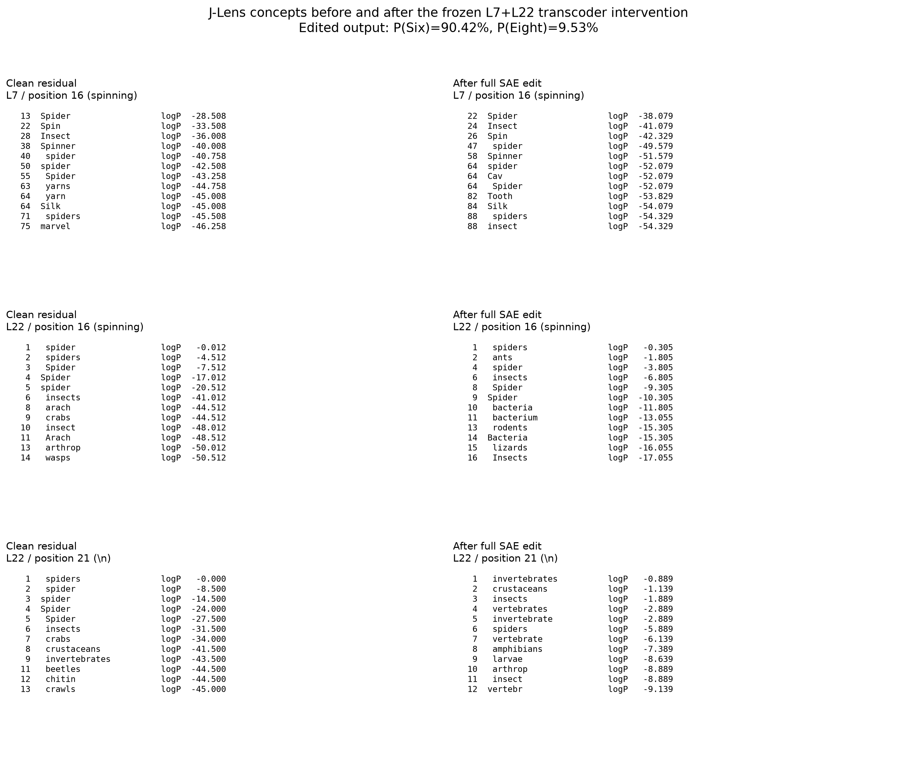
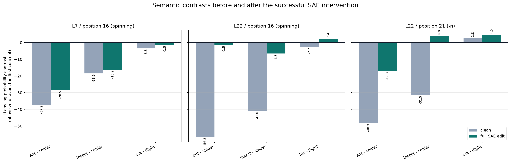
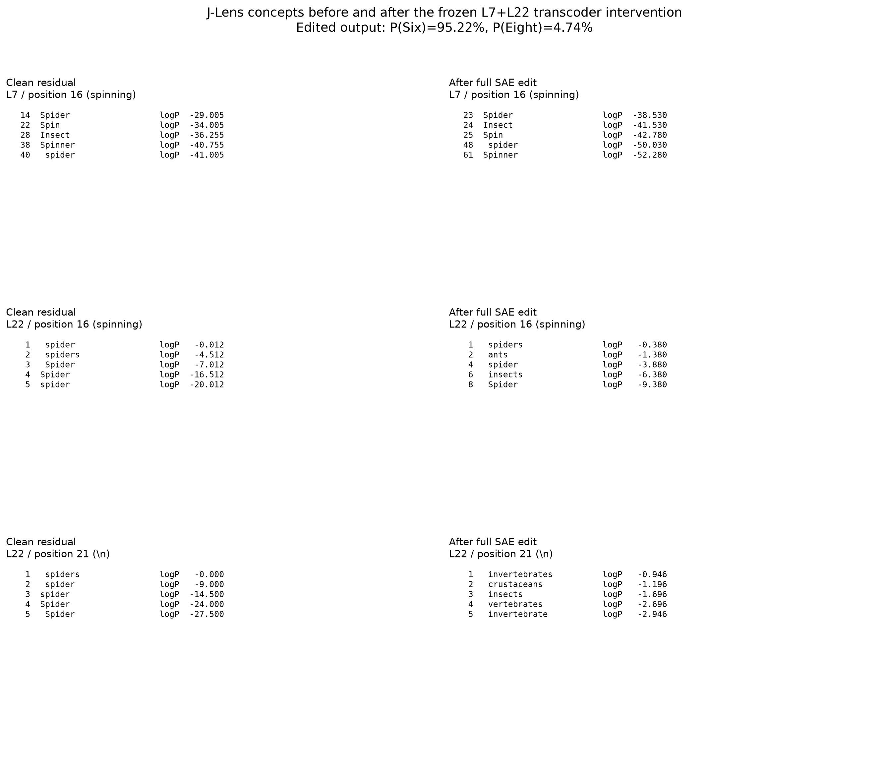
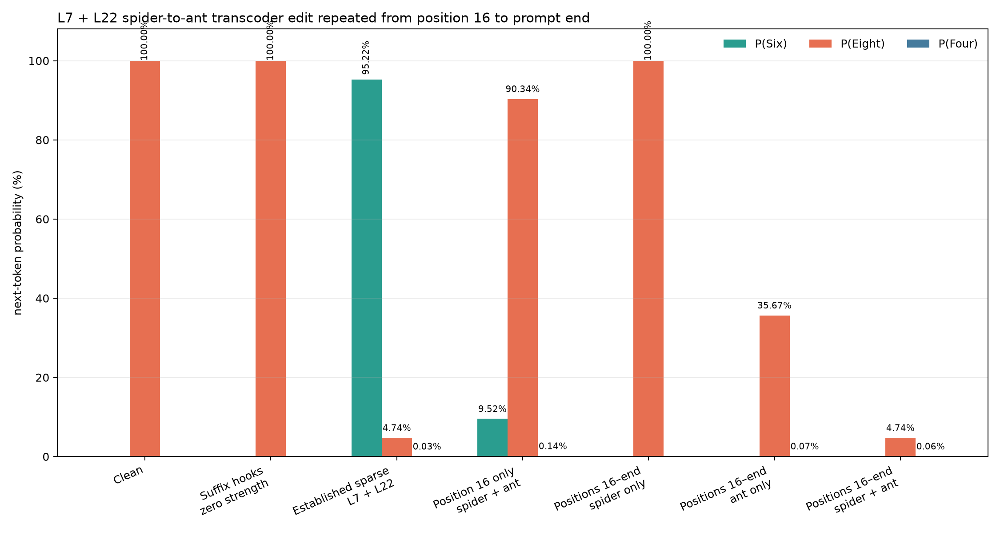

# Results: 2026-08-30

## J-Lens concepts before and after the successful SAE intervention (default attention)

This experiment reads the residual stream before and after the frozen
spider-to-ant transcoder intervention. It does **not** fit a new Jacobian Lens.
It uses Neuronpedia's published Gemma-3-4B-IT checkpoint, fitted on 546
WikiText prompts, at the exact cells edited by the SAE intervention:

- L7, position 16 (`spinning`)
- L22, position 16 (`spinning`)
- L22, position 21 (the turn-boundary newline)

The J-Lens operation is the published transport `h_l @ J_l.T`, followed by
Gemma's final normalization and LM head. Therefore, the displayed "concepts"
are vocabulary-token readouts of each residual state, not SAE feature labels.

### Frozen intervention

- **L7 / position 16:** suppress spider F14209 and F137239; inject ant F42685
  at factor 4.
- **L22 / position 16:** suppress spider F23422 and F60476; inject ant F1703
  and F197021 at factor 4.
- **L22 / position 21:** suppress spider F23422; inject no ant feature.

The clean run gives `P(Eight)=99.998248%`. The combined intervention gives
`P(Six)=90.416551%` and `P(Eight)=9.529834%` on the Secure Cloud A40.
The isolated edits remain weak: L7-only gives `P(Six)=0.091086%`, and L22-only
gives `P(Six)=0.002144%`. The strong flip therefore depends on the L7+L22
combination rather than either layer alone.

### Main observations

- **L7 / position 16:** `Spider` moves from rank 13 to rank 22. The best ant
  token improves from rank 1126 to rank 406, but ant is still not a leading
  readout. The fitted lens is weak and noisy this early in the network, so this
  is not a clean local spider-to-ant replacement.
- **L22 / position 16:** clean J-Lens is dominated by `spider`. After the full
  edit, `spiders` remains rank 1, but `ants` rises to rank 2 and `insects` to
  rank 6. The ant-minus-spider contrast moves from `-56.5` to `-1.5`, while
  Six-minus-Eight moves from `-2.7` to `+2.4`.
- **L22 / position 21:** clean J-Lens has `spiders` at rank 1. After the edit,
  the top concepts are `invertebrates`, `crustaceans`, and `insects`, with
  `spiders` falling to rank 6. Because no ant feature is injected at this
  position, the change is toward a broader animal/taxonomic representation,
  not a direct ant replacement. Insect-minus-spider moves from `-31.5` to
  `+4.0`.

### Interpretation

The successful SAE edit is visible to J-Lens, especially at L22, but it does
not look like a pure coordinate swap. At position 16, ant becomes a strong
competitor while spider remains present. At position 21, spider is displaced
by a broader insect/invertebrate neighborhood even though no ant feature was
injected there. This gives us a concrete basis for the next experiment:
compare the SAE residual delta with an explicit J-Lens spider-to-ant swap
direction using cosine similarity and causal output effects.

The earlier sweep reported `P(Six)=95.22%` for the same frozen target
activations, while this J-Lens capture run gives `90.42%`. A later controlled
run on the same A40 reproduces `95.22%` when it uses the sweep runner's eager
attention path. The J-Lens capture runner used Transformers' default attention
path. The discrepancy therefore should not be attributed to GPU identity
alone; the attention/backend configuration remains a plausible cause that has
not yet been isolated. The qualitative flip and each run's cleanup controls
are stable.

### Validation and provenance

- Clean output is Eight with probability above 99%.
- Edited output is Six with probability above 90%.
- Hooks are removed exactly: a post-cleanup pass matches the first clean pass.
- The L7 residual is exactly equal between the L7-only and full runs.
- Both selected J matrices are finite and have `d_model=2560`.
- Model revision: `093f9f388b31de276ce2de164bdc2081324b9767`.
- Neuronpedia lens revision: `0731326edff4ae730ffc5356fe1a4728c748b3a6`.
- Runtime: PyTorch 2.9.1, Transformers 5.16.1, CUDA 12.8, NVIDIA A40.

### Artifacts

- [Source script](../assets/results/2026-08-30/run_sae_jlens_before_after.py)
- [Raw JSON](../assets/results/2026-08-30/sae_jlens_before_after.json)
- [Frozen manifest](../assets/results/2026-08-30/sae_jlens_before_after_manifest.json)
- [Top concepts CSV](../assets/results/2026-08-30/sae_jlens_top_concepts.csv)
- [Tracked concepts CSV](../assets/results/2026-08-30/sae_jlens_tracked_concepts.csv)
- [Semantic contrasts CSV](../assets/results/2026-08-30/sae_jlens_contrasts.csv)
- [Largest concept deltas CSV](../assets/results/2026-08-30/sae_jlens_delta_concepts.csv)
- [Captured residual states](../assets/results/2026-08-30/sae_jlens_residual_states.pt)
- [Run log](../assets/results/2026-08-30/run.log)
- [Published Neuronpedia J-Lens checkpoint](https://huggingface.co/neuronpedia/jacobian-lens/tree/main/gemma-3-4b-it/jlens/Salesforce-wikitext)

## Corrected eager-attention J-Lens top-five concepts

This rerun uses the same pinned Gemma revision and explicit `eager` attention
path as the established SAE sweep. It therefore reproduces the intended
positive control exactly: `P(Six)=95.222110%`, `P(Eight)=4.740829%`, and
`P(Four)=0.031943%` after the combined L7+L22 edit. The figure shows the top
five readable vocabulary-token concepts at each edited cell.

*The semantic picture is stable relative to the earlier 90.42% run even though
the final answer probability changes. At both L22 cells, the top-five concept
lists are identical; at L7, the same five concepts remain with only small rank
changes.*

### Output controls

| Condition | Top token | P(Six) | P(Eight) | P(Four) |
| --- | ---: | ---: | ---: | ---: |
| Clean | Eight | 0.000011% | 99.998248% | 0.001670% |
| L7 only | Eight | 0.317159% | 99.648488% | 0.033428% |
| L22 only | Eight | 0.002144% | 99.996114% | 0.001670% |
| L7+L22 | Six | 95.222110% | 4.740829% | 0.031943% |

Neither layer flips the answer alone. The high-probability `Six` result still
depends on their interaction.

### Top-five interpretation

- **L7 / position 16:** the readable concepts remain spider/web related.
  `Spider` moves from rank 14 to rank 23, but no ant token enters the first
  five readable concepts. The early J-Lens readout remains weak and indirect.
- **L22 / position 16:** clean is entirely spider variants. After the edit,
  `spiders` is rank 1, `ants` rank 2, `spider` rank 4, `insects` rank 6, and
  `Spider` rank 8. Ant becomes a close competitor without erasing spider.
  The ant-minus-spider contrast moves from `-57.012` to `-1.030`, while
  Six-minus-Eight moves from `-2.799` to `+2.498`.
- **L22 / position 21:** clean is entirely spider variants. After the edit,
  the five readable concepts are `invertebrates`, `crustaceans`, `insects`,
  `vertebrates`, and `invertebrate`. No ant feature was injected at this
  position, so this is a broader taxonomic displacement. Insect-minus-spider
  moves from `-31.500` to `+5.229`.

### Validation and provenance

- Clean and post-cleanup probabilities and captured residuals match exactly.
- The L7 residual agrees exactly between the L7-only and combined runs.
- Both selected J matrices are finite and have `d_model=2560`.
- Model revision: `093f9f388b31de276ce2de164bdc2081324b9767`.
- J-Lens checkpoint revision: `0731326edff4ae730ffc5356fe1a4728c748b3a6`.
- Runtime: PyTorch 2.9.1, Transformers 5.16.1, CUDA 12.8, NVIDIA A40,
  eager attention.

### Artifacts

- [Source script](../assets/results/2026-08-30/run_sae_jlens_before_after_eager_top5.py)
- [Raw JSON](../assets/results/2026-08-30/sae_jlens_eager_top5.json)
- [Frozen manifest](../assets/results/2026-08-30/sae_jlens_eager_top5_manifest.json)
- [Top-five concepts CSV](../assets/results/2026-08-30/sae_jlens_eager_top5_top_concepts.csv)
- [Tracked concepts CSV](../assets/results/2026-08-30/sae_jlens_eager_top5_tracked_concepts.csv)
- [Semantic contrasts CSV](../assets/results/2026-08-30/sae_jlens_eager_top5_contrasts.csv)
- [Largest concept deltas CSV](../assets/results/2026-08-30/sae_jlens_eager_top5_delta_concepts.csv)
- [Semantic contrast figure](../assets/results/2026-08-30/sae_jlens_eager_top5_tracked_concept_changes.png)
- [Run log](../assets/results/2026-08-30/sae_jlens_eager_top5_run.log)

- Source: `scripts/run_sae_jlens_before_after.py`
- Figure: `docs/assets/results/2026-08-30/sae_jlens_eager_top5_top_concepts_before_after.png`

## Repeating the L7+L22 intervention from position 16 to prompt end

This experiment asks whether applying the successful L7+L22 edit at every
remaining prompt token makes the answer even more strongly `Six`. It repeats
the frozen feature set at all 11 positions from `16` through `26`:

`spinning`, ` animal`, ` have`, `?`, `<end_of_turn>`, newline,
`<start_of_turn>`, `model`, newline, `Answer`, `:`.

At each selected position, the runner fully suppresses the same spider
features and adds factor 4 times each feature's frozen ant-reference
activation. It preserves the original MLP output and adds only the selected
decoder deltas. This is deliberately a literal repeated clamp; it does not
claim that the ant features naturally activate at every one of these tokens.

### Results

| Condition | Top next token | P(Six) | P(Eight) | P(Four) |
| --- | ---: | ---: | ---: | ---: |
| Clean | Eight (99.998248%) | 0.000011% | 99.998248% | 0.001670% |
| Zero-strength suffix hooks | Eight (99.998248%) | 0.000011% | 99.998248% | 0.001670% |
| Established sparse L7+L22 edit | Six (95.222110%) | 95.222110% | 4.740829% | 0.031943% |
| Position 16 only, spider+ant | Eight (90.336162%) | 9.521361% | 90.336162% | 0.135815% |
| Positions 16-26, spider only | Eight (99.996912%) | 0.002754% | 99.996912% | 0.000290% |
| Positions 16-26, ant only | Two (45.800450%) | 0.000010% | 35.669425% | 0.068858% |
| Positions 16-26, spider+ant | Two (57.773763%) | 0.000009% | 4.742359% | 0.059697% |

For the final repeated spider+ant condition, `One` is also very large at
`35.041562%`. Thus the loss of `Eight` is not a transfer to `Six`.

### Interpretation

- The established sparse placement is still best and reproduces
  `P(Six)=95.22%` in this run.
- Applying the complete L7+L22 edit only at position 16 moves substantial mass
  toward `Six`, but does not flip the answer. The established edit also uses
  L22 spider suppression at position 21; there is no ant injection at 21.
- Spider suppression across the full suffix is insufficient by itself:
  `Eight` remains above `99.996%`.
- Repeating the calibrated ant delta at every suffix token is destructive. It
  drives the answer toward `Two` and `One`, both with and without repeated
  spider suppression. This is an off-target numeric collapse, not a stronger
  spider-to-ant semantic replacement.

The conclusion is that token positions are not interchangeable. A feature
amplitude calibrated on the explicit ant reference token should not be copied
unchanged into punctuation, turn-boundary, role, and answer-cue positions.
A better follow-up is a cumulative endpoint sweep or position-specific ant
calibration, rather than another uniform all-token factor increase.

### Validation and provenance

- The zero-strength hooked run matches clean exactly.
- A clean run after hook removal also matches the first clean run exactly.
- The original sparse intervention is included as an in-run positive control.
- Model revision: `093f9f388b31de276ce2de164bdc2081324b9767`.
- Runtime: Python 3.12.3, PyTorch 2.9.1, Transformers 5.16.1, CUDA 12.8,
  NVIDIA A40, eager attention.

### Artifacts

- [Source script](../assets/results/2026-08-30/run_spider_ant_all_positions.py)
- [Raw JSON](../assets/results/2026-08-30/spider_ant_all_positions.json)
- [Tidy CSV](../assets/results/2026-08-30/spider_ant_all_positions.csv)
- [Frozen manifest](../assets/results/2026-08-30/spider_ant_all_positions_manifest.json)
- [Run log](../assets/results/2026-08-30/spider_ant_all_positions_run.log)
