# Results: 2026-08-30

## J-Lens concepts before and after the successful SAE intervention (default attention)

This experiment reads the residual stream before and after the frozen
spider-to-ant transcoder intervention. It does **not** fit a new Jacobian Lens.
It uses Neuronpedia's published Gemma-3-4B-IT checkpoint, fitted on 546
WikiText prompts, at the exact cells edited by the SAE intervention:

- L7, position 16 (`spinning`)
- L22, position 16 (`spinning`)
- L22, position 21 (the turn-boundary newline)

The J-Lens operation is the published transport `h_l @ J_l.T`, followed by
Gemma's final normalization and LM head. Therefore, the displayed "concepts"
are vocabulary-token readouts of each residual state, not SAE feature labels.

### Frozen intervention

- **L7 / position 16:** suppress spider F14209 and F137239; inject ant F42685
  at factor 4.
- **L22 / position 16:** suppress spider F23422 and F60476; inject ant F1703
  and F197021 at factor 4.
- **L22 / position 21:** suppress spider F23422; inject no ant feature.

The clean run gives `P(Eight)=99.998248%`. The combined intervention gives
`P(Six)=90.416551%` and `P(Eight)=9.529834%` on the Secure Cloud A40.
The isolated edits remain weak: L7-only gives `P(Six)=0.091086%`, and L22-only
gives `P(Six)=0.002144%`. The strong flip therefore depends on the L7+L22
combination rather than either layer alone.

### Main observations

- **L7 / position 16:** `Spider` moves from rank 13 to rank 22. The best ant
  token improves from rank 1126 to rank 406, but ant is still not a leading
  readout. The fitted lens is weak and noisy this early in the network, so this
  is not a clean local spider-to-ant replacement.
- **L22 / position 16:** clean J-Lens is dominated by `spider`. After the full
  edit, `spiders` remains rank 1, but `ants` rises to rank 2 and `insects` to
  rank 6. The ant-minus-spider contrast moves from `-56.5` to `-1.5`, while
  Six-minus-Eight moves from `-2.7` to `+2.4`.
- **L22 / position 21:** clean J-Lens has `spiders` at rank 1. After the edit,
  the top concepts are `invertebrates`, `crustaceans`, and `insects`, with
  `spiders` falling to rank 6. Because no ant feature is injected at this
  position, the change is toward a broader animal/taxonomic representation,
  not a direct ant replacement. Insect-minus-spider moves from `-31.5` to
  `+4.0`.

### Interpretation

The successful SAE edit is visible to J-Lens, especially at L22, but it does
not look like a pure coordinate swap. At position 16, ant becomes a strong
competitor while spider remains present. At position 21, spider is displaced
by a broader insect/invertebrate neighborhood even though no ant feature was
injected there. This gives us a concrete basis for the next experiment:
compare the SAE residual delta with an explicit J-Lens spider-to-ant swap
direction using cosine similarity and causal output effects.

The earlier sweep reported `P(Six)=95.22%` for the same frozen target
activations, while this J-Lens capture run gives `90.42%`. A later controlled
run on the same A40 reproduces `95.22%` when it uses the sweep runner's eager
attention path. The J-Lens capture runner used Transformers' default attention
path. The discrepancy therefore should not be attributed to GPU identity
alone; the attention/backend configuration remains a plausible cause that has
not yet been isolated. The qualitative flip and each run's cleanup controls
are stable.

### Validation and provenance

- Clean output is Eight with probability above 99%.
- Edited output is Six with probability above 90%.
- Hooks are removed exactly: a post-cleanup pass matches the first clean pass.
- The L7 residual is exactly equal between the L7-only and full runs.
- Both selected J matrices are finite and have `d_model=2560`.
- Model revision: `093f9f388b31de276ce2de164bdc2081324b9767`.
- Neuronpedia lens revision: `0731326edff4ae730ffc5356fe1a4728c748b3a6`.
- Runtime: PyTorch 2.9.1, Transformers 5.16.1, CUDA 12.8, NVIDIA A40.

### Artifacts

- [Source script](../assets/results/2026-08-30/run_sae_jlens_before_after.py)
- [Raw JSON](../assets/results/2026-08-30/sae_jlens_before_after.json)
- [Frozen manifest](../assets/results/2026-08-30/sae_jlens_before_after_manifest.json)
- [Top concepts CSV](../assets/results/2026-08-30/sae_jlens_top_concepts.csv)
- [Tracked concepts CSV](../assets/results/2026-08-30/sae_jlens_tracked_concepts.csv)
- [Semantic contrasts CSV](../assets/results/2026-08-30/sae_jlens_contrasts.csv)
- [Largest concept deltas CSV](../assets/results/2026-08-30/sae_jlens_delta_concepts.csv)
- [Captured residual states](../assets/results/2026-08-30/sae_jlens_residual_states.pt)
- [Run log](../assets/results/2026-08-30/run.log)
- [Published Neuronpedia J-Lens checkpoint](https://huggingface.co/neuronpedia/jacobian-lens/tree/main/gemma-3-4b-it/jlens/Salesforce-wikitext)

## Corrected eager-attention J-Lens top-five concepts

This rerun uses the same pinned Gemma revision and explicit `eager` attention
path as the established SAE sweep. It therefore reproduces the intended
positive control exactly: `P(Six)=95.222110%`, `P(Eight)=4.740829%`, and
`P(Four)=0.031943%` after the combined L7+L22 edit. The figure shows the top
five readable vocabulary-token concepts at each edited cell.

*The semantic picture is stable relative to the earlier 90.42% run even though
the final answer probability changes. At both L22 cells, the top-five concept
lists are identical; at L7, the same five concepts remain with only small rank
changes.*

### Output controls

| Condition | Top token | P(Six) | P(Eight) | P(Four) |
| --- | ---: | ---: | ---: | ---: |
| Clean | Eight | 0.000011% | 99.998248% | 0.001670% |
| L7 only | Eight | 0.317159% | 99.648488% | 0.033428% |
| L22 only | Eight | 0.002144% | 99.996114% | 0.001670% |
| L7+L22 | Six | 95.222110% | 4.740829% | 0.031943% |

Neither layer flips the answer alone. The high-probability `Six` result still
depends on their interaction.

### Top-five interpretation

- **L7 / position 16:** the readable concepts remain spider/web related.
  `Spider` moves from rank 14 to rank 23, but no ant token enters the first
  five readable concepts. The early J-Lens readout remains weak and indirect.
- **L22 / position 16:** clean is entirely spider variants. After the edit,
  `spiders` is rank 1, `ants` rank 2, `spider` rank 4, `insects` rank 6, and
  `Spider` rank 8. Ant becomes a close competitor without erasing spider.
  The ant-minus-spider contrast moves from `-57.012` to `-1.030`, while
  Six-minus-Eight moves from `-2.799` to `+2.498`.
- **L22 / position 21:** clean is entirely spider variants. After the edit,
  the five readable concepts are `invertebrates`, `crustaceans`, `insects`,
  `vertebrates`, and `invertebrate`. No ant feature was injected at this
  position, so this is a broader taxonomic displacement. Insect-minus-spider
  moves from `-31.500` to `+5.229`.

### Validation and provenance

- Clean and post-cleanup probabilities and captured residuals match exactly.
- The L7 residual agrees exactly between the L7-only and combined runs.
- Both selected J matrices are finite and have `d_model=2560`.
- Model revision: `093f9f388b31de276ce2de164bdc2081324b9767`.
- J-Lens checkpoint revision: `0731326edff4ae730ffc5356fe1a4728c748b3a6`.
- Runtime: PyTorch 2.9.1, Transformers 5.16.1, CUDA 12.8, NVIDIA A40,
  eager attention.

### Artifacts

- [Source script](../assets/results/2026-08-30/run_sae_jlens_before_after_eager_top5.py)
- [Raw JSON](../assets/results/2026-08-30/sae_jlens_eager_top5.json)
- [Frozen manifest](../assets/results/2026-08-30/sae_jlens_eager_top5_manifest.json)
- [Top-five concepts CSV](../assets/results/2026-08-30/sae_jlens_eager_top5_top_concepts.csv)
- [Tracked concepts CSV](../assets/results/2026-08-30/sae_jlens_eager_top5_tracked_concepts.csv)
- [Semantic contrasts CSV](../assets/results/2026-08-30/sae_jlens_eager_top5_contrasts.csv)
- [Largest concept deltas CSV](../assets/results/2026-08-30/sae_jlens_eager_top5_delta_concepts.csv)
- [Semantic contrast figure](../assets/results/2026-08-30/sae_jlens_eager_top5_tracked_concept_changes.png)
- [Run log](../assets/results/2026-08-30/sae_jlens_eager_top5_run.log)

- Source: `scripts/run_sae_jlens_before_after.py`
- Figure: `docs/assets/results/2026-08-30/sae_jlens_eager_top5_top_concepts_before_after.png`

## Downstream P16 trajectory from L22 to the final block

This experiment follows the successful L7+L22 intervention at the original
`spinning` token, position 16, through every downstream block. The positive
control again gives `P(Six)=95.222110%` and `P(Eight)=4.740829%`. For each
layer, it compares the clean and edited residuals directly and reports the top
five readable vocabulary-token concepts from the layer-specific J-Lens.

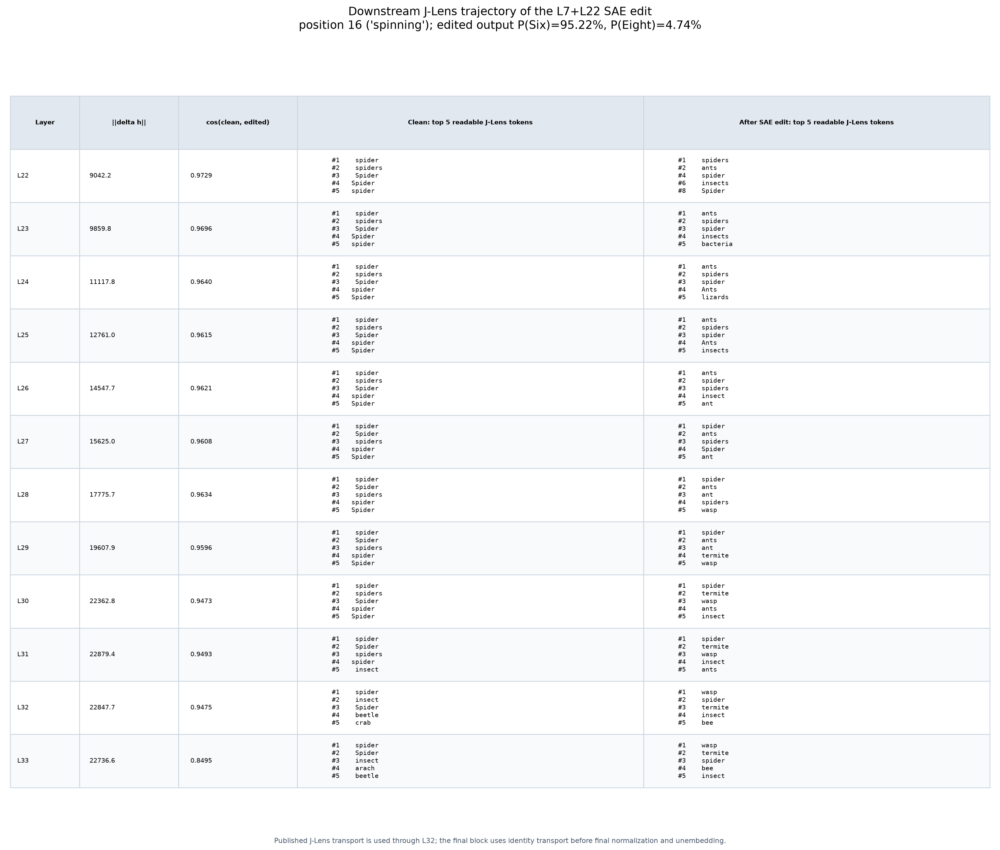

*The residual change remains nonzero at every layer. The top-five readout
changes from spider, through an ant-dominant phase, into a broader insect
neighborhood.*

### Propagation is directly visible

- The residual delta norm grows from `9042.2` at L22 to `22736.6` at L33.
- Relative to the clean residual norm, the delta grows from `0.232` at L22 to
  `0.586` at L33.
- Clean-versus-edited cosine falls from `0.9729` at L22 to `0.8495` at L33.
- Every L22-L33 residual delta is nonzero, and the clean run after hook removal
  matches the original clean run exactly.

Thus the L22/P16 edit is not a transient overwrite that disappears at the
next block. It remains a substantial same-token state change through the end
of the network.

### Semantic trajectory

- **L22:** `spiders` remains rank 1 and `ants` is rank 2.
- **L23-L26:** `ants` becomes rank 1. Spider variants remain nearby, while
  `insects`, `bacteria`, `lizards`, and `ant` enter the neighborhood.
- **L27-L31:** `spider` returns to rank 1, but ant and broader insect concepts
  remain in the top five. `wasp` and `termite` appear by L28-L31.
- **L32-L33:** `wasp` becomes rank 1. The edited readout is dominated by
  `wasp`, `termite`, `bee`, `insect`, and a remaining `spider` token.

The ant-minus-spider contrast is positive from L23 through L26, peaking at
`+6.11` at L25. It becomes negative again from L27 onward, even though the
readout remains shifted toward the insect neighborhood. This is a changing
representation, not a fixed ant token carried unchanged through depth.

### What this does and does not show

At P16, the J-Lens Six-minus-Eight contrast is positive from L22 through L27,
then becomes slightly negative at L28-L32 and nearly neutral at L33. Yet the
actual answer at the final prompt position is `Six` with `95.22%` probability.
That is expected: the model predicts the answer from the later answer-cue
position, not directly from the terminal P16 state.

This result proves same-token hidden-state propagation at P16. It does not by
itself trace the complete route into the answer. The next causal-localization
step would inspect positions 17-26 across L23-L33 to see where downstream
attention transfers the edited information into the later token states.

### J-Lens boundary and validation

- The published checkpoint contains source-layer transports L0-L32, so this
  figure uses published J-Lens matrices for L22-L32.
- L33 is already the final block output and therefore uses identity transport
  before Gemma's final normalization and unembedding.
- Model revision: `093f9f388b31de276ce2de164bdc2081324b9767`.
- J-Lens checkpoint revision: `0731326edff4ae730ffc5356fe1a4728c748b3a6`.
- Runtime: PyTorch 2.9.1, Transformers 5.16.1, CUDA 12.8, NVIDIA A40,
  eager attention.
- Full residual tensors were not exported; only derived norms, readouts, and
  validation summaries were saved.

### Artifacts

- [Source script](../assets/results/2026-08-30/run_sae_jlens_p16_downstream.py)
- [Raw summarized JSON](../assets/results/2026-08-30/sae_jlens_p16_downstream.json)
- [Frozen manifest](../assets/results/2026-08-30/sae_jlens_p16_downstream_manifest.json)
- [Layer trajectory CSV](../assets/results/2026-08-30/sae_jlens_p16_downstream_trajectory.csv)
- [Top-five concepts CSV](../assets/results/2026-08-30/sae_jlens_p16_downstream_top_concepts.csv)
- [Run log](../assets/results/2026-08-30/sae_jlens_p16_downstream_run.log)

- Source: `scripts/run_sae_jlens_p16_downstream.py`
- Figure: `docs/assets/results/2026-08-30/sae_jlens_p16_downstream_top5.png`

## Position-by-position downstream J-Lens trajectories, P16-P21

The earlier figure is specifically the readout at P16 (`spinning`). This
follow-up holds the successful SAE intervention fixed and changes only the
position whose residual stream is read through the J-Lens. The model edit is
still:

- L7/P16: suppress two spider features and inject the L7 ant feature at factor
  4.
- L22/P16: suppress two spider features and inject both L22 ant features at
  factor 4.
- L22/P21: suppress the selected spider feature, with no ant injection.

P17-P20 are clean tests of cross-position propagation: none is directly
edited. P21 is different because it is itself the L22 spider-suppression site,
although it receives no ant injection.

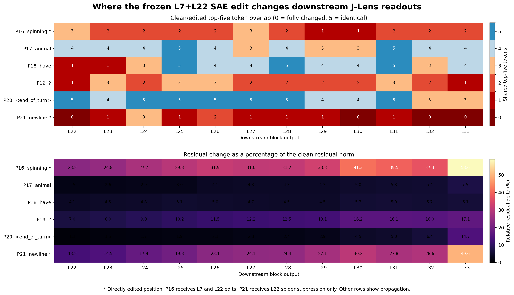

*Top-five overlap and residual change tell related but non-equivalent stories.
Direct sites P16 and P21 change strongly, but the unedited question mark at
P19 is a clear propagation exception. A stable top five at P20 also coexists
with a nonzero and growing hidden-state difference.*

| Position | Prompt token | Direct edit? | Mean shared top-five tokens | Relative delta at L22 | Relative delta at L33 | L33 cosine |
| --- | --- | --- | ---: | ---: | ---: | ---: |
| P16 | `spinning` | Yes: L7 and L22 | 2.00 / 5 | 23.2% | 58.6% | 0.8495 |
| P17 | ` animal` | No | 3.92 / 5 | 2.5% | 7.5% | 0.9972 |
| P18 | ` have` | No | 3.58 / 5 | 4.1% | 6.1% | 0.9983 |
| P19 | `?` | No | 2.17 / 5 | 7.0% | 17.1% | 0.9944 |
| P20 | `<end_of_turn>` | No | 4.42 / 5 | 1.1% | 14.7% | 0.9903 |
| P21 | turn-boundary newline | Yes: L22 spider suppression only | 0.92 / 5 | 13.2% | 49.6% | 0.8705 |

All position figures come from the same frozen intervention and therefore have
the same final output: clean `P(Eight)=99.998248%`, versus edited
`P(Six)=95.222110%` and `P(Eight)=4.740829%`.

### P17: the ` animal` token

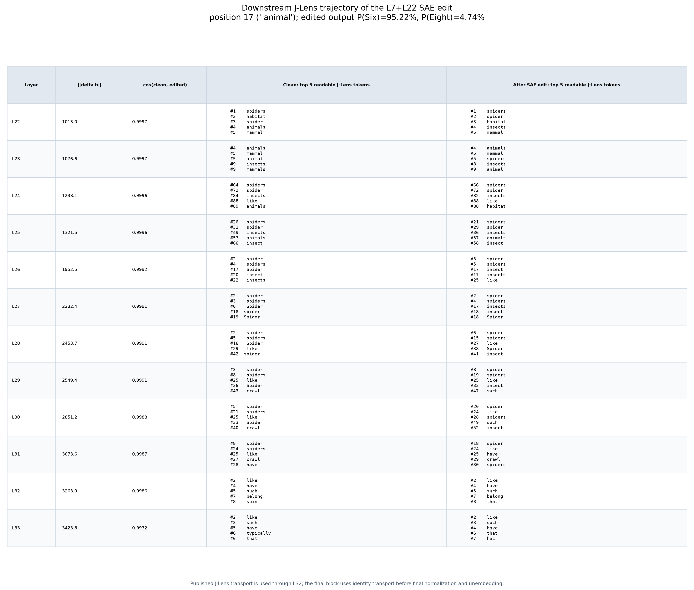

The edit reaches P17 without directly touching it, but the change is modest.
The clean and edited lists remain centered on spiders, animals, mammals, and
insects, with four of the top five tokens still overlapping at L33. This is
evidence of cross-position propagation, but not of a large semantic rewrite at
P17.

### P18: the ` have` token

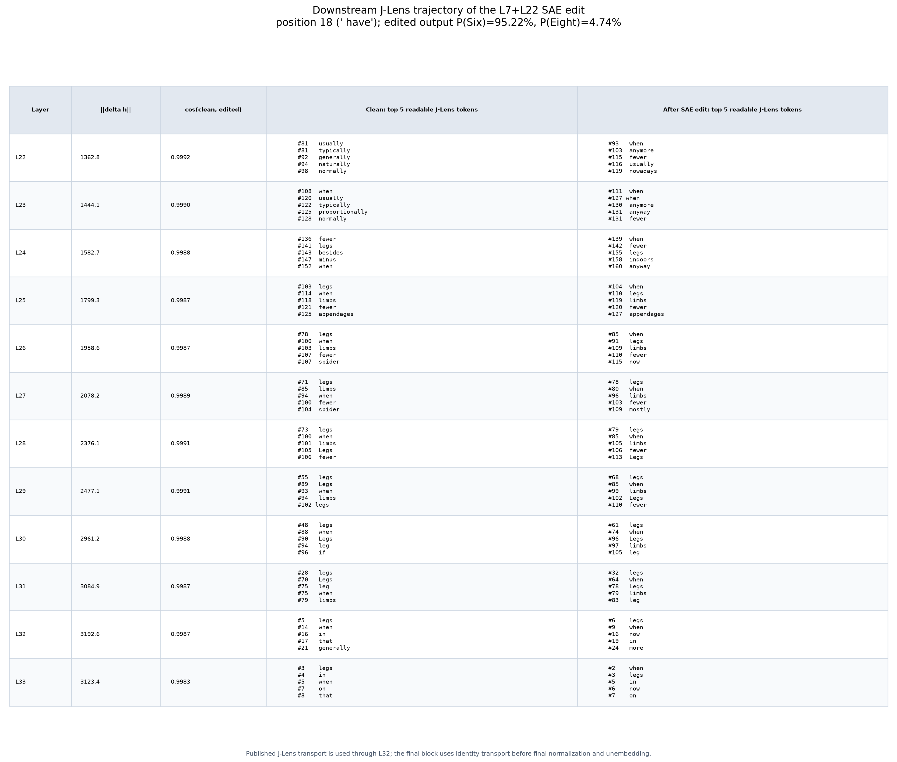

P18 is also unedited. Its residual change stays small, approximately 4%-6% of
the clean norm. The top-five lists initially reorder generic temporal and
comparative tokens such as `usually`, `when`, `anymore`, and `fewer`, then
largely converge on `legs`, `limbs`, and `when`. No ant, insect, or Six surface
enters the top five. This is propagated influence without a target-identity
readout.

### P19: the question-mark token

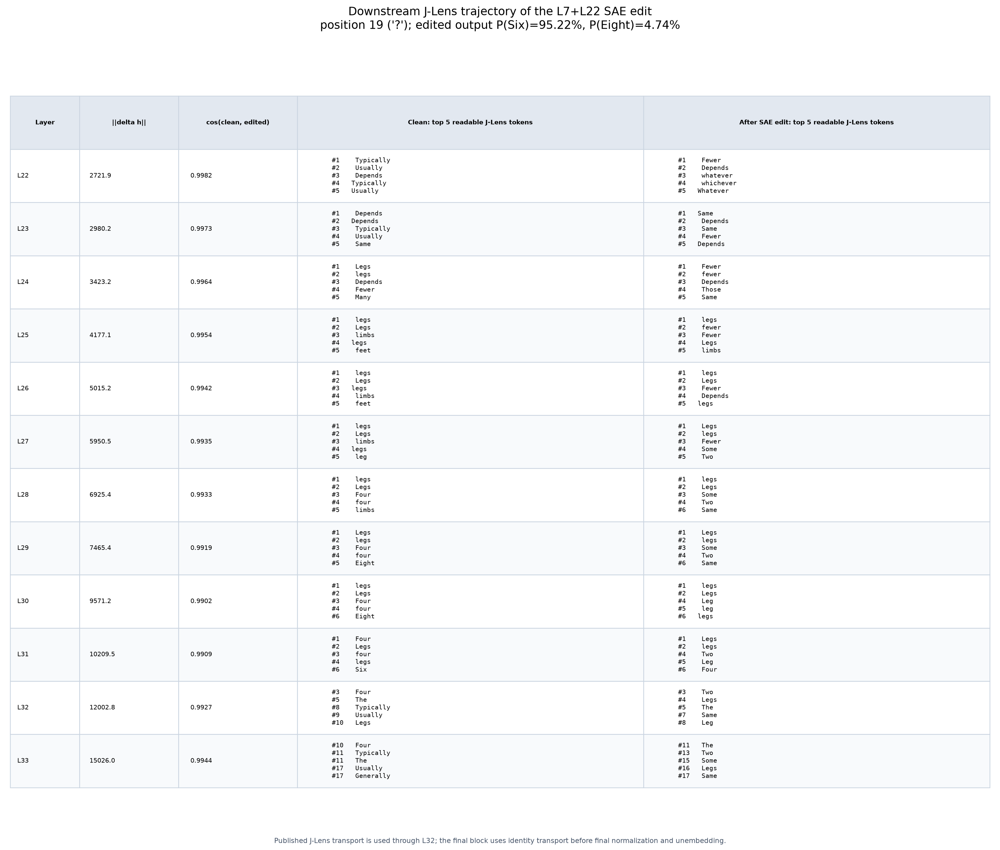

The propagated change is much larger at the question mark. The edited readout
moves through `Fewer`/`fewer`, then `Some` and `Two`, while the clean trajectory
is more strongly associated with `Legs`, `Four`, and `Eight`. No ant, insect,
termite, wasp, or Six surface enters the edited top five. The Six family gets
no better than vocabulary rank 12, while clean Six is already rank 6-7 at
nearby layers. P19 therefore shows a changed quantity/leg-related readout, not
an ant or explicit Six representation.

### P20: the `<end_of_turn>` token

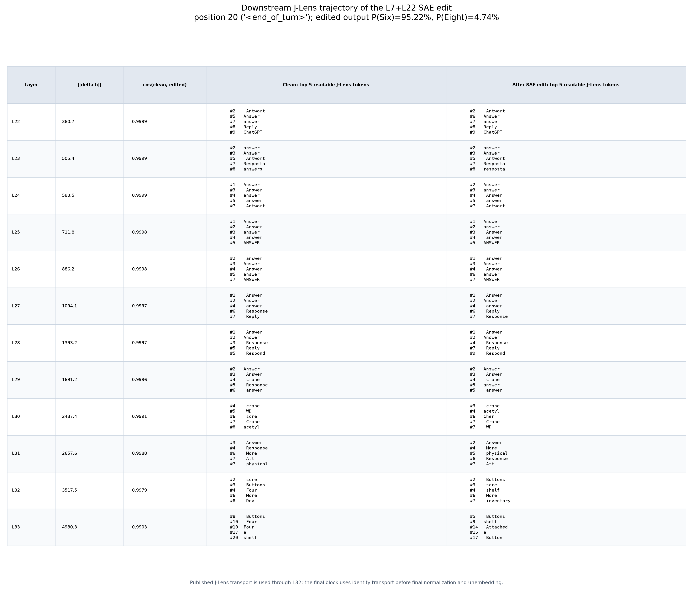

P20 is the strongest example of top-five stability despite a real hidden-state
change. Clean and edited lists share all five tokens at seven of the twelve
layers and remain dominated by multilingual `Answer`/`Response` surfaces
through L29. Yet its relative residual delta grows from 1.1% at L22 to 14.7%
at L33. The late readout becomes fragmented rather than ant- or Six-like. Thus
an unchanged top five is not evidence that the intervention had zero effect.

### P21: the turn-boundary newline

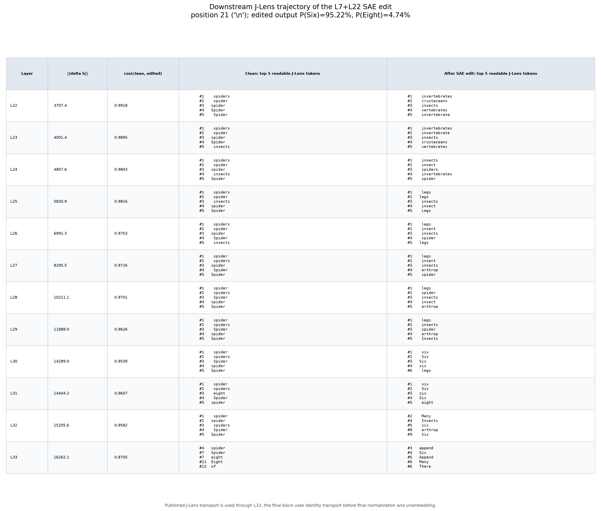

P21 shows the clearest progression. The edited top-five readout begins with a
broad taxonomic neighborhood (`invertebrates`, `crustaceans`, `insects`),
moves toward `insects` and `legs`, and reaches explicit `six`/`Six` tokens at
L30-L31. The clean readout stays spider-heavy. This is consistent with a path
from altered animal category to leg-count evidence to the answer, but it is
not a pure propagation result: P21 is directly spider-suppressed at L22.

### Comparison

Directly edited P16 and P21 have the largest residual changes and persistently
low top-five overlap, so direct editing does predict a strong local effect.
However, direct editing is not necessary for downstream change: unedited P19
has only 2.17 of five tokens shared on average and a residual change that grows
to 17.1%. Conversely, P20 preserves most top-five surfaces while its residual
still diverges.

The corrected pattern is therefore: direct edits usually cause the strongest
same-position readout changes, but later unedited positions can acquire changes
through causal attention, depending on the token's computational role. Top-five
membership is a thresholded summary and cannot serve as a binary changed versus
unchanged test. The network also does not carry one fixed `ant` coordinate
unchanged through depth: P19 looks quantity-related, while the strongest
explicit `Six` readout occurs at P21.

These are descriptive J-Lens readouts of a causal SAE intervention. A readable
token entering the top five is evidence about the locally decodable
neighborhood, not by itself proof that the model represents exactly that
literal word.

### Validation and artifacts

- Each run reproduces the clean and 95.22% SAE-positive-control probabilities.
- Every captured L22-L33 residual delta is nonzero.
- Zero-strength and post-hook-cleanup checks match clean exactly.
- Published J-Lens matrices are used for L22-L32; L33 uses identity transport
  because it is already the terminal block output.
- Model revision: `093f9f388b31de276ce2de164bdc2081324b9767`.
- J-Lens checkpoint revision: `0731326edff4ae730ffc5356fe1a4728c748b3a6`.
- Runtime: PyTorch 2.9.1, Transformers 5.16.1, CUDA 12.8, NVIDIA A40,
  eager attention.

P17: [raw JSON](../assets/results/2026-08-30/sae_jlens_p17_downstream.json),
[manifest](../assets/results/2026-08-30/sae_jlens_p17_downstream_manifest.json),
[trajectory CSV](../assets/results/2026-08-30/sae_jlens_p17_downstream_trajectory.csv),
[top-five CSV](../assets/results/2026-08-30/sae_jlens_p17_downstream_top_concepts.csv),
[run log](../assets/results/2026-08-30/sae_jlens_p17_downstream_run.log).

P18: [raw JSON](../assets/results/2026-08-30/sae_jlens_p18_downstream.json),
[manifest](../assets/results/2026-08-30/sae_jlens_p18_downstream_manifest.json),
[trajectory CSV](../assets/results/2026-08-30/sae_jlens_p18_downstream_trajectory.csv),
[top-five CSV](../assets/results/2026-08-30/sae_jlens_p18_downstream_top_concepts.csv),
[run log](../assets/results/2026-08-30/sae_jlens_p18_downstream_run.log).

P19: [raw JSON](../assets/results/2026-08-30/sae_jlens_p19_downstream.json),
[manifest](../assets/results/2026-08-30/sae_jlens_p19_downstream_manifest.json),
[trajectory CSV](../assets/results/2026-08-30/sae_jlens_p19_downstream_trajectory.csv),
[top-five CSV](../assets/results/2026-08-30/sae_jlens_p19_downstream_top_concepts.csv),
[run log](../assets/results/2026-08-30/sae_jlens_p19_downstream_run.log).

P20: [raw JSON](../assets/results/2026-08-30/sae_jlens_p20_downstream.json),
[manifest](../assets/results/2026-08-30/sae_jlens_p20_downstream_manifest.json),
[trajectory CSV](../assets/results/2026-08-30/sae_jlens_p20_downstream_trajectory.csv),
[top-five CSV](../assets/results/2026-08-30/sae_jlens_p20_downstream_top_concepts.csv),
[run log](../assets/results/2026-08-30/sae_jlens_p20_downstream_run.log).

P21: [raw JSON](../assets/results/2026-08-30/sae_jlens_p21_downstream.json),
[manifest](../assets/results/2026-08-30/sae_jlens_p21_downstream_manifest.json),
[trajectory CSV](../assets/results/2026-08-30/sae_jlens_p21_downstream_trajectory.csv),
[top-five CSV](../assets/results/2026-08-30/sae_jlens_p21_downstream_top_concepts.csv),
[run log](../assets/results/2026-08-30/sae_jlens_p21_downstream_run.log).

- [Source script](../assets/results/2026-08-30/run_sae_jlens_p16_downstream.py)
- [Comparison source](../assets/results/2026-08-30/plot_sae_jlens_position_comparison.py)
- [Comparison CSV](../assets/results/2026-08-30/sae_jlens_position_comparison.csv)
- [Comparison manifest](../assets/results/2026-08-30/sae_jlens_position_comparison_manifest.json)
- Figures: `docs/assets/results/2026-08-30/sae_jlens_p{16..21}_downstream_top5.png`

## Repeating the L7+L22 intervention from position 16 to prompt end

This experiment asks whether applying the successful L7+L22 edit at every
remaining prompt token makes the answer even more strongly `Six`. It repeats
the frozen feature set at all 11 positions from `16` through `26`:

`spinning`, ` animal`, ` have`, `?`, `<end_of_turn>`, newline,
`<start_of_turn>`, `model`, newline, `Answer`, `:`.

At each selected position, the runner fully suppresses the same spider
features and adds factor 4 times each feature's frozen ant-reference
activation. It preserves the original MLP output and adds only the selected
decoder deltas. This is deliberately a literal repeated clamp; it does not
claim that the ant features naturally activate at every one of these tokens.

### Results

| Condition | Top next token | P(Six) | P(Eight) | P(Four) |
| --- | ---: | ---: | ---: | ---: |
| Clean | Eight (99.998248%) | 0.000011% | 99.998248% | 0.001670% |
| Zero-strength suffix hooks | Eight (99.998248%) | 0.000011% | 99.998248% | 0.001670% |
| Established sparse L7+L22 edit | Six (95.222110%) | 95.222110% | 4.740829% | 0.031943% |
| Position 16 only, spider+ant | Eight (90.336162%) | 9.521361% | 90.336162% | 0.135815% |
| Positions 16-26, spider only | Eight (99.996912%) | 0.002754% | 99.996912% | 0.000290% |
| Positions 16-26, ant only | Two (45.800450%) | 0.000010% | 35.669425% | 0.068858% |
| Positions 16-26, spider+ant | Two (57.773763%) | 0.000009% | 4.742359% | 0.059697% |

For the final repeated spider+ant condition, `One` is also very large at
`35.041562%`. Thus the loss of `Eight` is not a transfer to `Six`.

### Interpretation

- The established sparse placement is still best and reproduces
  `P(Six)=95.22%` in this run.
- Applying the complete L7+L22 edit only at position 16 moves substantial mass
  toward `Six`, but does not flip the answer. The established edit also uses
  L22 spider suppression at position 21; there is no ant injection at 21.
- Spider suppression across the full suffix is insufficient by itself:
  `Eight` remains above `99.996%`.
- Repeating the calibrated ant delta at every suffix token is destructive. It
  drives the answer toward `Two` and `One`, both with and without repeated
  spider suppression. This is an off-target numeric collapse, not a stronger
  spider-to-ant semantic replacement.

The conclusion is that token positions are not interchangeable. A feature
amplitude calibrated on the explicit ant reference token should not be copied
unchanged into punctuation, turn-boundary, role, and answer-cue positions.
A better follow-up is a cumulative endpoint sweep or position-specific ant
calibration, rather than another uniform all-token factor increase.

### Validation and provenance

- The zero-strength hooked run matches clean exactly.
- A clean run after hook removal also matches the first clean run exactly.
- The original sparse intervention is included as an in-run positive control.
- Model revision: `093f9f388b31de276ce2de164bdc2081324b9767`.
- Runtime: Python 3.12.3, PyTorch 2.9.1, Transformers 5.16.1, CUDA 12.8,
  NVIDIA A40, eager attention.

### Artifacts

- [Source script](../assets/results/2026-08-30/run_spider_ant_all_positions.py)
- [Raw JSON](../assets/results/2026-08-30/spider_ant_all_positions.json)
- [Tidy CSV](../assets/results/2026-08-30/spider_ant_all_positions.csv)
- [Frozen manifest](../assets/results/2026-08-30/spider_ant_all_positions_manifest.json)
- [Run log](../assets/results/2026-08-30/spider_ant_all_positions_run.log)

## Animal-identity control for the successful L7+L22 edit

The leg-count result does not by itself establish a literal `spider -> ant`
identity replacement: ants, wasps, termites, and bees all support the answer
`Six`. This control therefore asks the model to name the animal instead:

`Answer in one word: What animal is famous for web-spinning behavior worldwide?`

The identity and leg-count prompts both contain exactly 27 tokens. In both,
position 16 is `spinning`, position 21 is the turn-boundary newline, and the
answer cue ends at position 26. The experiment can therefore reuse the exact
frozen intervention sites without remapping token positions.

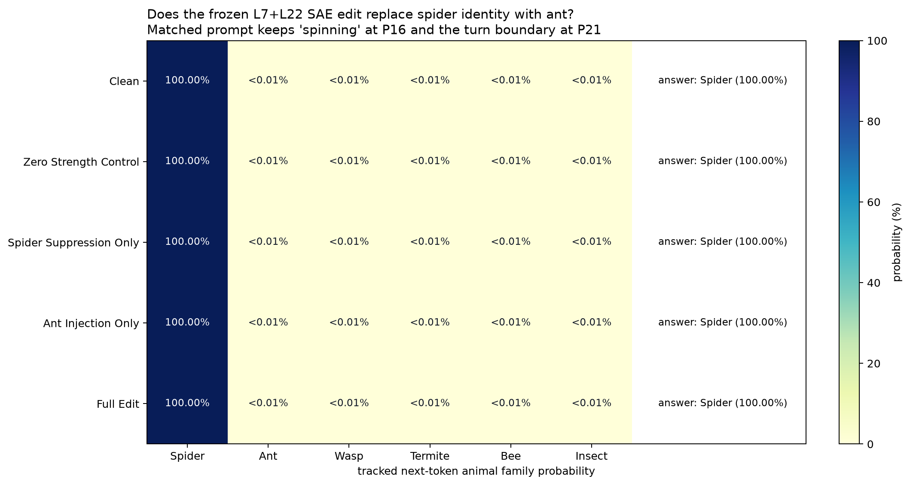

*The clean model, zero-strength hooks, spider suppression alone, ant injection
alone, and the full edit all answer `Spider`. Tracked ant, wasp, termite, bee,
and generic-insect probabilities remain negligible.*

### Results

| Identity condition | Greedy answer | Top-token probability |
| --- | ---: | ---: |
| Clean | Spider | 99.999976% |
| Zero-strength hooks | Spider | 99.999976% |
| Spider suppression only | Spider | 99.999976% |
| Ant injection only | Spider | 99.999988% |
| Full L7+L22 edit | Spider | 99.999988% |

Under the full edit, the tracked ant-family probability is only
`4.23e-17` (probability, not percent); it is not elevated above the clean
value of `6.33e-17`. The full edit does modestly increase some other insect
alternatives in relative terms, but their absolute probabilities remain tiny:
bee is `5.68e-14` and generic insect is `4.44e-14`.

The same run includes the original leg-count task as a positive control:

| Leg-count condition | Greedy answer | Top-token probability |
| --- | ---: | ---: |
| Clean | Eight | 99.998260% |
| Full L7+L22 edit | Six | 95.222133% |

### Interpretation

This falsifies the strong claim that the current intervention makes the
model's final animal identity answer `Ant`. It successfully changes the
leg-count answer while leaving an explicitly queried identity decisively
`Spider`. The result is more consistent with a task-specific shift toward a
six-leg/insect answer representation than with a clean spider-to-ant semantic
substitution.

It does not prove that no ant-related direction was added locally: a local SAE
delta or J-Lens readout can change while downstream evidence still determines
the final answer. It does show that the present edit is insufficient to
produce an ant identity at the output, and that the earlier downstream `wasp`
J-Lens readout should not be interpreted as a literal wasp answer or a proven
wasp SAE feature.

### Validation and provenance

- The identity prompt's edited cells exactly match the leg prompt: P16 is
  `spinning` and P21 is the turn-boundary newline.
- The zero-strength hooked logits match clean, and a clean run after hook
  removal also matches clean.
- The leg-count positive control reproduces the established 95.22% `Six`
  result in the same loaded model.
- Model revision: `093f9f388b31de276ce2de164bdc2081324b9767`.
- Runtime: Python 3.12.3, PyTorch 2.9.1, Transformers 5.16.1, CUDA 12.8,
  NVIDIA A40, eager attention.

### Artifacts

- [Source script](../assets/results/2026-08-30/run_spider_ant_identity_control.py)
- [Raw JSON](../assets/results/2026-08-30/spider_ant_identity_control.json)
- [Tidy CSV](../assets/results/2026-08-30/spider_ant_identity_control.csv)
- [Frozen manifest](../assets/results/2026-08-30/spider_ant_identity_control_manifest.json)

- Source: `scripts/run_spider_ant_identity_control.py`
- Figure: `docs/assets/results/2026-08-30/spider_ant_identity_control.png`

## SAE-site-matched direct J-Lens steering

This experiment asks whether the three causal locations found by the successful
SAE intervention transfer directly to published J-Lens token directions. It
edits only the pre-registered cells:

- L7/P16 (`spinning`): target up and `Spider` down.
- L22/P16 (`spinning`): target up and ` spider` down.
- L22/P21 (turn-boundary newline): ` spiders` down only.

Each token direction is `unit(J_layer.T @ unembedding[token])`. The edit is
added through the same post-feedforward hook as the SAE runner. Its scale is
the prompt-derived mean clean residual norm at that layer: `9343.19` at L7
and `47433.58` at L22. These are prompt approximations because the published
checkpoint does not provide corpus-wide mean residual norms.

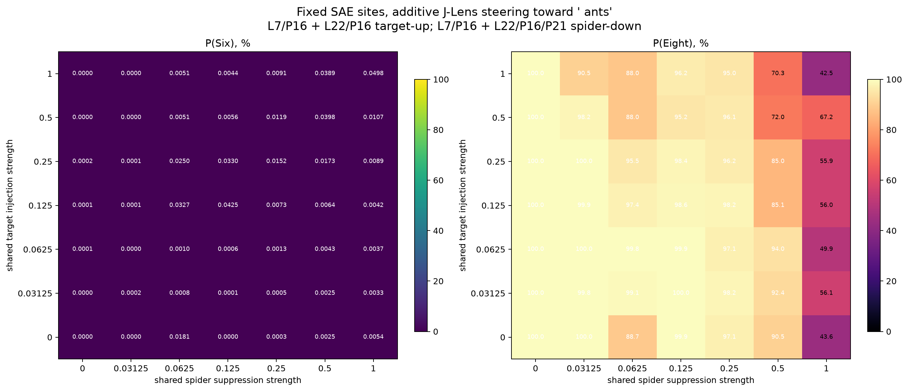

*The literal ` ants` direction never produces a meaningful Six probability in
the shared grid. Large spider suppression can remove probability from Eight,
but it does not transfer that probability to Six.*

### Main result: a shift, but no causal flip

The frozen eager-attention controls reproduce the established baselines:

| Condition | Target direction | P(Six) | P(Eight) | P(Four) | Top token |
| --- | --- | ---: | ---: | ---: | --- |
| Clean | none | 0.000011% | 99.998248% | 0.001670% | Eight |
| SAE positive control | learned SAE features | 95.222110% | 4.740829% | 0.031943% | Six |
| Best fixed-site J-Lens edit | ` insect` | 14.638259% | 84.237367% | 0.935793% | Eight |

The best J-Lens condition is additive, not a coordinate clamp. Its independently
refined strengths are:

- L7 target `+0.140625`, L7 spider `-0.1875`.
- L22 target `+0.3125`, L22 spider `-0.625`; the L22 spider factor applies at
  both P16 and P21.

The Six-minus-Eight log probability difference moves from `-16.00` clean to
`-1.75`, a large change, but it remains negative. Six is still not top, so no
tested condition reaches the causal-flip or strong-reproduction success level.
The best run does pass the coarse numeric-coherence criterion:
`P(Six)+P(Eight)=98.8756%` and `P(Four)<1%`.

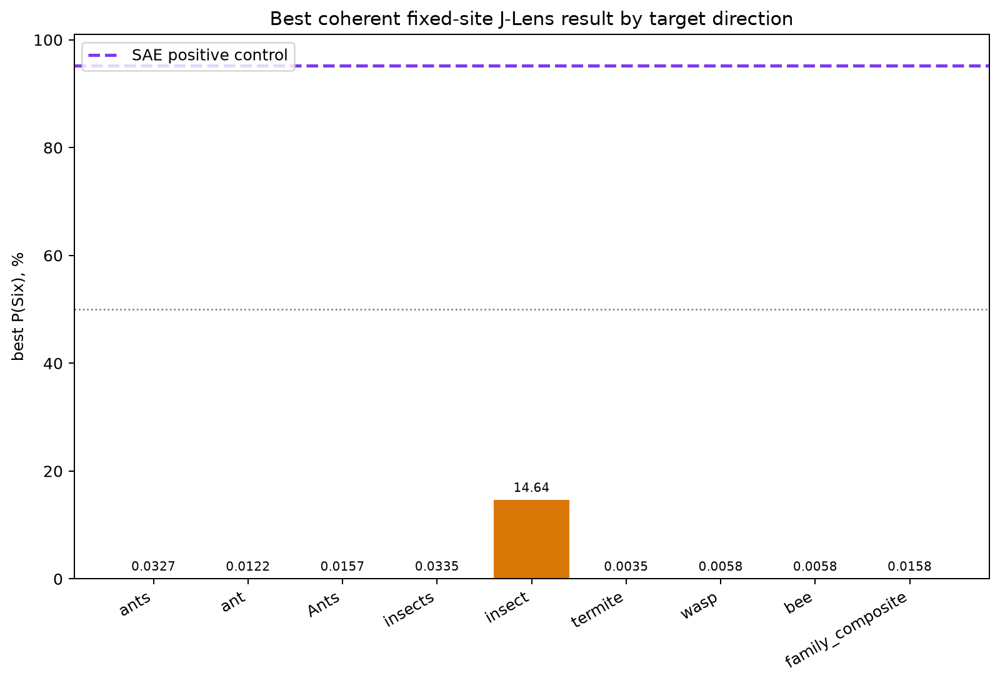

*No literal ant-family target succeeds. The 14.64% result appears only after
coordinate-descent refinement of the singular ` insect` surrogate and is not
evidence of ant replacement.*

All three primary ant surfaces, all five pre-registered insect-family
alternatives, and the fixed family composite were screened. Their best shared
grid Six probabilities remain small: ` ants` reaches `0.0327%`, ` ant`
`0.0122%`, ` Ants` `0.0157%`, and the best initial ` insect` grid cell
`0.0907%`. The two-pass four-coordinate refinement raises only the selected
` insect` result to `14.6383%`.

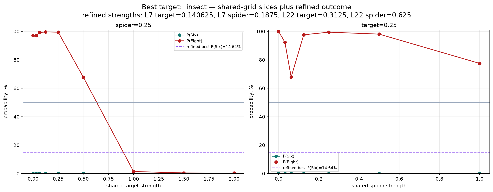

### Controls show that the combined edit is necessary

| Control | P(Six) | P(Eight) | P(Four) | Top token |
| --- | ---: | ---: | ---: | --- |
| Target only | 0.000789% | 99.982762% | 0.009610% | Eight |
| Spider only | 0.000256% | 88.077652% | 11.920014% | Eight |
| L7 only | 0.033535% | 99.965835% | 0.000083% | Eight |
| L22 only | 0.003712% | 81.753808% | 18.241741% | Eight |
| Matched-strength ` lizards` | 0.003494% | 98.806775% | 1.097644% | Eight |
| Matched-norm random directions | 0.000614% | 99.979132% | 0.012338% | Eight |

Neither target addition nor spider subtraction explains the 14.64% result by
itself. It comes from their joint, layer-specific interaction. The off-target
and random controls also remain overwhelmingly Eight.

### The J-Lens and SAE edits are geometrically different

| Site | Realized J-Lens delta norm | Norm / clean layer scale | Cosine with SAE delta | SAE delta captured by selected J-Lens span |
| --- | ---: | ---: | ---: | ---: |
| L7/P16 | 1694.7 | 0.1814 | 0.0068 | 0.69% |
| L22/P16 | 27310.1 | 0.5758 | 0.0165 | 1.66% |
| L22/P21 | 29636.8 | 0.6248 | 0.0883 | 8.85% |

At both P16 sites, the last column is the norm fraction of the SAE delta in
the two-direction source/target span. At P21 it is the corresponding
single-source projection. All are small. Thus matching the layer, position,
and concept label does not make a J-Lens token direction equivalent to the SAE
decoder edit.

The requested source coordinates decrease and target coordinates increase at
every applicable site. Direction overlap therefore does not trigger the
pre-registered pseudoinverse coordinate-clamp fallback; the failure is not
caused by the additive edit moving its immediate J-Lens coordinates in the
wrong direction.

### Downstream readout

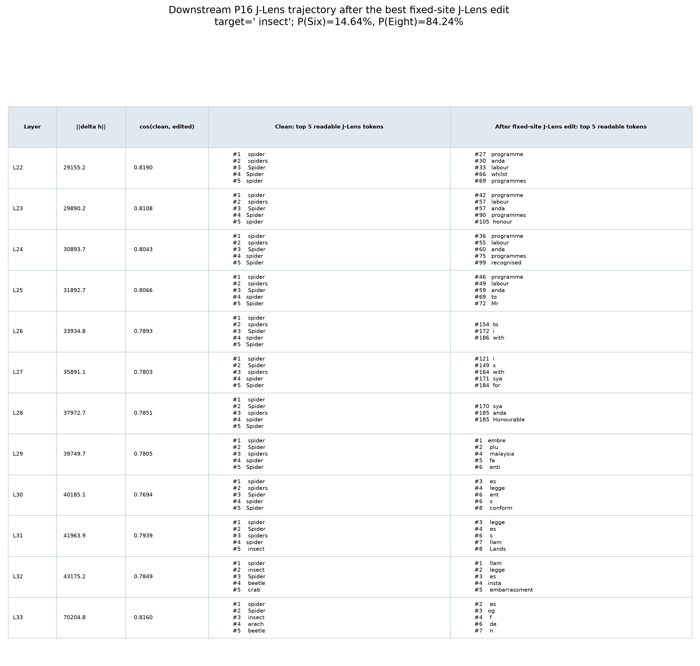

The clean P16 readout stays spider-dominant through depth. After the direct
J-Lens edit, the top-five readable tokens are mostly unrelated or fragmented
tokens such as `programme`, `labour`, `anda`, and later multilingual word
pieces. They do not form a stable ant or insect trajectory. This makes the
14.64% output shift look unlike a clean semantic replacement, even though the
final numeric distribution remains concentrated on Six and Eight.

### Conclusion

The SAE-discovered sites are not sufficient for the tested published J-Lens
token directions and bounded direct-steering strengths. Direct J-Lens steering
at exactly L7/P16, L22/P16, and L22/P21 moves substantial probability toward
Six, but does not flip the answer and does not reproduce the SAE's 95.22%
result. This is a negative transfer result for these coordinates, not evidence
that other layers, positions, independently learned J-Lens concepts, or a
different scaling convention could never work.

### Validation and provenance

- The run contains 634 J-Lens grid, refinement, validation, and control
  conditions.
- Zero-strength hook logits are bitwise identical to clean; the maximum logit
  error is exactly zero.
- The best run repeats with matching probabilities, and the clean run after
  hook removal matches the original clean residuals exactly.
- The realized block-output edit has cosine above `0.99999` with the intended
  direction at all three sites; bfloat16 relative errors are `0.31%-0.39%`.
- All candidate surfaces remain one token, all loaded J matrices are finite,
  and all constructed directions are unit-normalized.
- Model revision: `093f9f388b31de276ce2de164bdc2081324b9767`.
- J-Lens revision: `0731326edff4ae730ffc5356fe1a4728c748b3a6`;
  `n_prompts=546`, `d_model=2560`.
- Runtime: Python 3.12.3, PyTorch 2.9.1, Transformers 5.16.1, J-Lens 0.1.0,
  CUDA 12.8, NVIDIA A40, eager attention.

### Artifacts

- [Source script](../assets/results/2026-08-30/run_sae_site_jlens_steering_sweep.py)
- [Raw JSON](../assets/results/2026-08-30/sae_site_jlens_steering.json)
- [Frozen manifest](../assets/results/2026-08-30/sae_site_jlens_steering_manifest.json)
- [Tidy CSV](../assets/results/2026-08-30/sae_site_jlens_steering.csv)
- [Downstream top-five CSV](../assets/results/2026-08-30/sae_site_jlens_best_downstream_top5.csv)
- [Primary heatmaps](../assets/results/2026-08-30/sae_site_jlens_primary_heatmaps.png)
- [Candidate summary](../assets/results/2026-08-30/sae_site_jlens_candidate_summary.png)
- [Best-result curves](../assets/results/2026-08-30/sae_site_jlens_best_curves.png)
- [Downstream trajectory figure](../assets/results/2026-08-30/sae_site_jlens_best_downstream_top5.png)
- [Run log](../assets/results/2026-08-30/sae_site_jlens_steering_run.log)

- Source: `scripts/run_sae_site_jlens_steering_sweep.py`
- Figures: `docs/assets/results/2026-08-30/sae_site_jlens_*.png`
